# TECH INTERVIEW HELPER FOR SWEs

## 1. COMPLEXITY FUNDAMENTALS (Big O Notation)

**What is Big O?**
Big O measures how an algorithm's performance scales as input size grows. It describes worst-case time/space complexity.
- Focus on **dominant term** (ignore constants and lower-order terms)
- Example: O(n² + n) → simplifies to O(n²)
- Example: O(2n) → simplifies to O(n)

### 📊 Growth Comparison (operations at n = 1,000)

```
O(1)        ▏ 1                                       ✅ Instant
O(log n)    ▎ 10                                      ✅ Instant
O(n)        █ 1,000                                   ✅ Fast
O(n log n)  ██ 10,000                                 ✅ Acceptable
O(n²)       ████████████████ 1,000,000                ⚠️  Slow
O(n³)       ████████████████████████ 1,000,000,000    ❌ Too slow
O(2ⁿ)       ████████████████████████ ~10³⁰¹           ❌ Unusable
O(n!)       ████████████████████████ ~10²⁵⁶⁷          ❌ Unusable
```

### 🔀 "Is My Algorithm Fast Enough?" Decision Flow

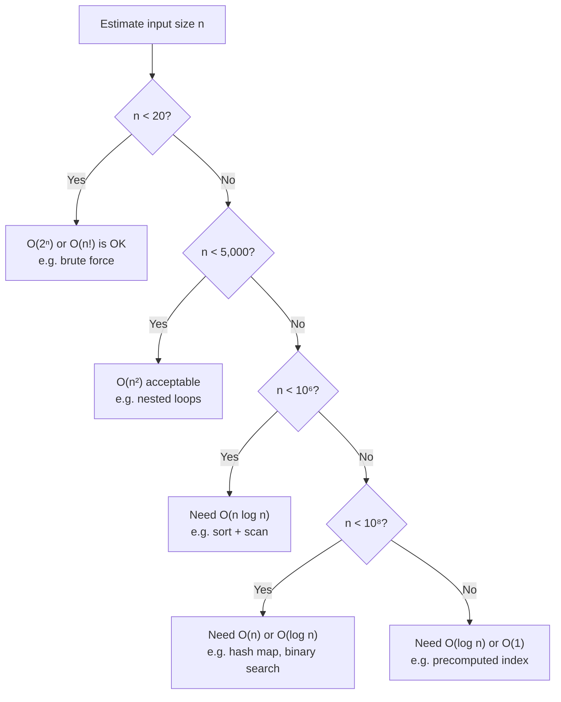

| Notation | Name | Example | 1M Operations Time |
|----------|------|---------|-------------------|
| **O(1)** | Constant | Hash map lookup: `map[key]` | 1 nanosecond |
| **O(log n)** | Logarithmic | Binary search on sorted array | ~20 operations |
| **O(n)** | Linear | Loop through array, find max | 1 millisecond |
| **O(n log n)** | Linearithmic | Merge sort, quick sort | ~20 milliseconds |
| **O(n²)** | Quadratic | Nested loops: bubble sort | 1000 milliseconds |
| **O(n³)** | Cubic | Triple nested loops | 1000000 milliseconds |
| **O(2^n)** | Exponential | Recursive without memoization | Unusable |
| **O(n!)** | Factorial | Generate all permutations | Unusable |

#### Rule of Thumb
- **O(1), O(log n), O(n)**: Fast ✅
- **O(n log n)**: Acceptable
- **O(n²)**: Slow (avoid for n > 10K)
- **O(2^n), O(n!)**: Unacceptable

#### Examples
```
Array of 1M items:
  O(1):     1 lookup
  O(log n): 20 lookups (binary search)
  O(n):     1M lookups
  O(n²):    1 trillion operations (SLOW)
```

---

## 2. DATA STRUCTURES

### 🔀 "Which Data Structure Should I Use?" Decision Tree

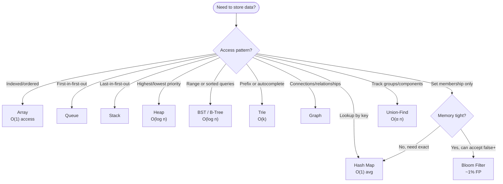

| Name | Description | Example |
|------|-------------|---------|
| Hash Map | O(1) key-value lookup | User cache: `{user_id: userData}` |
| Array | O(1) random access, ordered | Transaction list: `[tx1, tx2, tx3]` |
| Linked List | O(1) insert/delete in middle | LRU cache eviction |
| Stack | LIFO, O(1) push/pop | Browser back button |
| Queue | FIFO, O(1) enqueue/dequeue | Job queue, message broker |
| Heap | O(log n) insert/remove, maintains priority | Top-k most expensive transactions |
| Binary Search Tree | O(log n) search if balanced, range queries | Leaderboard, price range queries |
| Trie | Fast prefix search, O(k) where k=word length | Autocomplete suggestions |
| Graph | Adjacency list representation | Social network, friend connections |
| Union-Find | O(α(n)) track connected components | Detect friend network clusters |
| Bloom Filter | Space-efficient set membership | "Seen user before?" check (1% false pos) |
| Hash Table | Handles collisions via chaining/open addressing | Database index buckets |

---

## 3. ALGORITHMS

### 🔀 "Which Algorithm Fits My Problem?" Decision Tree

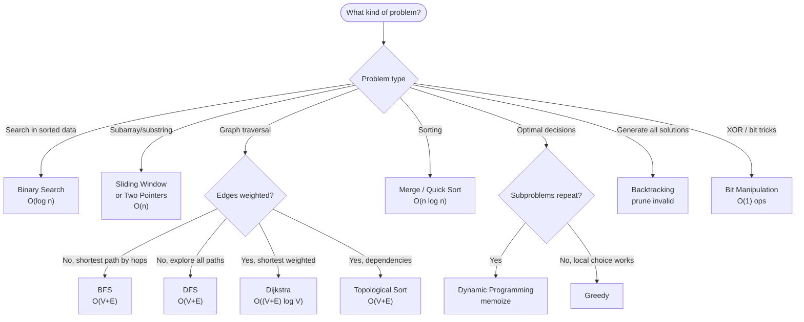

| Name | Description | Example |
|------|-------------|---------|
| Binary Search | O(log n) on sorted data, divide in half | Find user in sorted user list |
| Two Pointers | O(n) traverse from two ends | Palindrome check, two-sum |
| Sliding Window | O(n) fixed/dynamic window over sequence | Max sum of k consecutive items |
| BFS | O(V+E) level-by-level, shortest unweighted path | Shortest friend connection path |
| DFS | O(V+E) recursive deep traversal, backtracking | Topological sort, find all paths |
| Dijkstra | O((V+E) log V) shortest weighted path | Fastest delivery route |
| Merge Sort | O(n log n) divide-conquer, stable | Sort transactions by amount |
| Quick Sort | O(n log n) avg, in-place partitioning | Sort user IDs |
| Dynamic Programming | Memoize subproblems, O(n²) or better | Longest increasing sequence |
| Greedy | Local optimal choice for global optimal | Activity selection, huffman coding |
| Topological Sort | O(V+E) linear order respecting dependencies | Service startup order (A depends on B) |
| Backtracking | Explore all possibilities, prune invalid | N-Queens, permutations |
| Bit Manipulation | O(1) XOR/AND/OR operations | Find single number (rest appear twice) |
| Union-Find Algo | Union: merge sets, Find: check same component | Are two users in same network? |

---

## 4. DESIGN PATTERNS

### 🌳 GoF Pattern Hierarchy

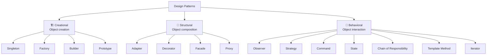

### CREATIONAL (Object Creation)

| Pattern | Description | IRL Example |
|---------|-------------|------------|
| Singleton | One instance globally, lazy/eager init | Database connection pool, logger |
| Factory | Create objects without specifying classes | `createPayment("stripe")` vs `createPayment("paypal")` |
| Builder | Construct complex objects step-by-step | Build API request: `.setAuth().setTimeout().setRetry()` |
| Prototype | Clone existing object instead of creating new | Copy user session for new request |

### STRUCTURAL (Object Composition)

| Pattern | Description | IRL Example |
|---------|-------------|------------|
| Adapter | Convert incompatible interfaces | Stripe adapter wraps Stripe API to your interface |
| Decorator | Add behavior without modifying original | Add logging/retry to API call without changing function |
| Facade | Simplify complex subsystem | Payment facade: hides Stripe + Paypal + Crypto details |
| Proxy | Placeholder/surrogate for another object | Lazy load user data: proxy returns data on first access |

### BEHAVIORAL (Object Interaction & Responsibility)

| Pattern | Description | IRL Example |
|---------|-------------|------------|
| Observer | Notify multiple listeners of state change | Event-driven: `transaction.on('completed', handler)` |
| Strategy | Swap algorithms at runtime | `payment.execute(stripeStrategy)` vs `payment.execute(paypalStrategy)` |
| Command | Encapsulate request as object | Queue job: `new TransferFundsCommand(user, amount)` |
| State | Object changes behavior based on state | Transaction: pending → confirmed → settled (different methods) |
| Chain of Responsibility | Pass request through handler chain | Auth → validation → rate-limit → execute |
| Template Method | Define algorithm skeleton, subclasses fill steps | PaymentProcessor base: `validate() → execute() → settle()` |
| Iterator | Access elements sequentially | Paginate through results: `hasNext()` → `next()` |

---

## 5. MICROSERVICES PATTERNS & CONCEPTS

### 🏛️ Typical Microservices Architecture

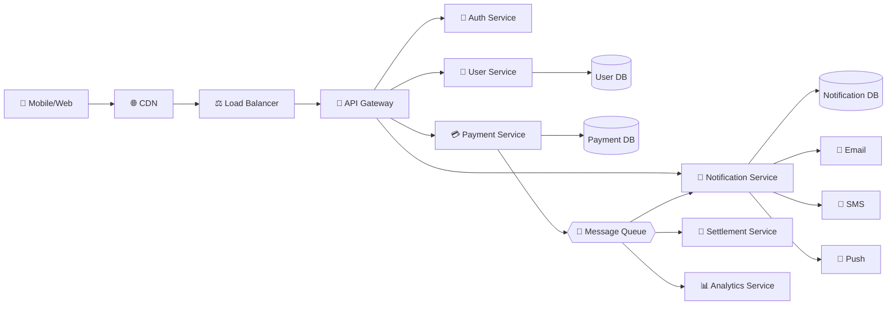

### 🔄 Saga Pattern: Distributed Transaction Flow

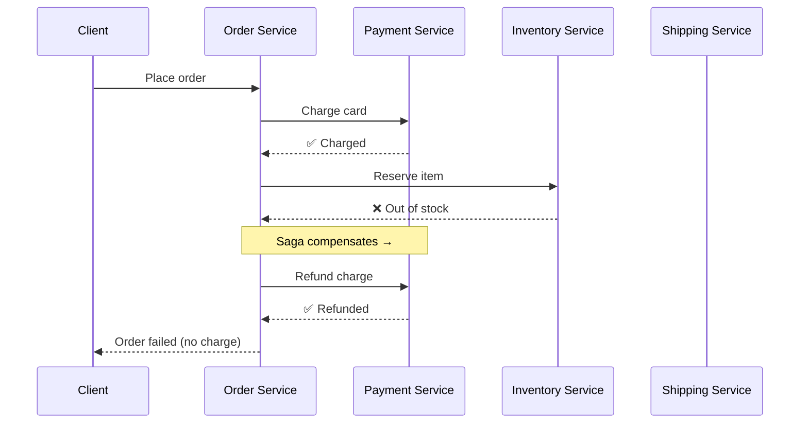

### ARCHITECTURE PATTERNS

| Pattern | Description | IRL Example |
|---------|-------------|------------|
| API Gateway | Single entry point, routes to services | `api.appnation.com/*` routes to User/Payment/Notification services |
| Service Discovery | Services find each other dynamically | When Payment Service starts, register in Consul/Eureka, others auto-discover |
| Load Balancer | Distribute requests across instances | 3 User Service replicas: request goes to least-loaded |
| Circuit Breaker | Fail fast when downstream dies | Payment Service calls Stripe, if 5 failures → return cached result, retry later |
| Bulkhead | Isolate resources per service | Transaction Service uses thread pool X, Notification uses pool Y (one doesn't starve other) |
| Retry Pattern | Auto-retry with backoff | Payment failed? Retry with exponential backoff: 1s, 2s, 4s, 8s |

### DATA PATTERNS

| Pattern | Description | IRL Example |
|---------|-------------|------------|
| Database per Service | Each service owns its data | User Service has `users` DB, Payment Service has `transactions` DB (no shared DB) |
| Event Sourcing | Store state changes as events | Instead of `balance = 1000`, store: `deposit(500)`, `withdraw(100)`, `deposit(600)` |
| CQRS | Separate read model from write model | Write: `transaction → settlement`, Read: `leaderboard → cached materialized view` |
| Saga Pattern | Distribute transaction across services | Book flight (Reserve) → Pay (Payment) → Confirm (Email). If pay fails, cancel reserve |
| Outbox Pattern | Ensure message + DB update together | Write to `transactions` + `outbox` table atomically, then send message |

### COMMUNICATION PATTERNS

| Pattern | Description | IRL Example |
|---------|-------------|------------|
| Synchronous (REST/gRPC) | Request-response, immediate reply | Mobile app calls `GET /user/:id` → blocks until response |
| Asynchronous (Message Queue) | Fire and forget via broker | `transaction.created` event → RabbitMQ → Settlement Service processes async |
| Publish-Subscribe | One event, multiple subscribers | `transaction.settled` → Notification Service (SMS), Analytics Service (log), Dashboard (update) |
| Request-Reply | Async with correlation ID | Settlement Service publishes `tx.settled` with tx_id, client polls or subscribes |
| Event Streaming | Immutable log of events | Kafka: all transactions logged, new services replay from start (event sourcing) |

### OPERATIONAL PATTERNS

| Pattern | Description | IRL Example |
|---------|-------------|------------|
| Health Check | Endpoint returning service status | `GET /health` → `{status: "healthy", timestamp: ...}` |
| Graceful Shutdown | Complete in-flight requests before dying | Pod termination: stop accepting requests, wait 30s, close connections |
| Canary Deployment | Roll out to % of users first | Deploy to 5% users, monitor crash rate, if ok → 100% |
| Blue-Green Deployment | Two identical environments, switch traffic | Blue (old) runs, Green (new) tested, switch when ready, rollback easy |
| Distributed Tracing | Track request across services | Request ID: `req-123` → User Service (10ms) → Payment Service (50ms) → Notification (20ms) |
| Rate Limiting | Limit requests per user/IP | Max 100 requests/min per user, excess requests rejected or queued |

### FAILURE HANDLING

| Pattern | Description | IRL Example |
|---------|-------------|------------|
| Timeouts | Don't wait forever | API call: 5s timeout, if no response → fail fast, don't block caller |
| Fallback | Use degraded response on failure | Leaderboard service down? Return cached version from 1 hour ago |
| Bulkhead Isolation | Prevent cascade failure | Payment failures don't kill Notification Service (separate thread pools) |
| Dead Letter Queue | Store failed messages for replay | Message processing failed 3x → move to DLQ, ops team debugs later |
| Idempotency | Same request, safe to retry | `transfer(tx_id=123, amount=100)` → idempotent key prevents double-debit |

---

## 6. BACKEND (WITH NODEJS)

### 🔄 Node.js Event Loop

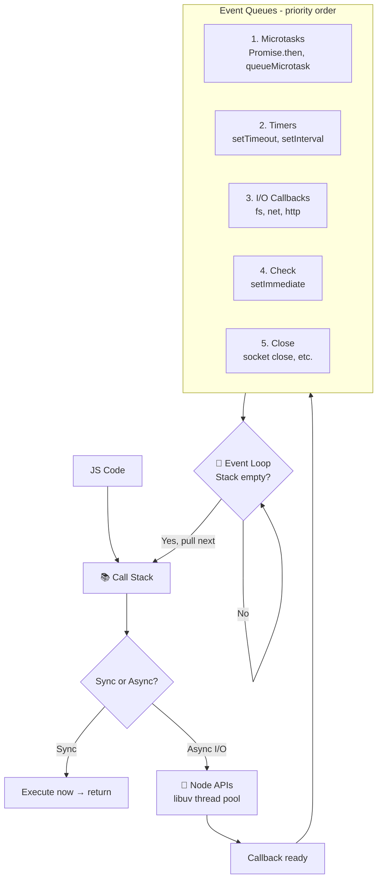

### 🛤️ Express Middleware Pipeline


### NODEJS CORE CONCEPTS

| Concept | Description | IRL Example |
|---------|-------------|------------|
| Event Loop | Single-threaded, async execution | setTimeout fires after blocking code finishes, no true parallelism |
| Callback | Function passed to another, invoked later | `fs.readFile('data.json', (err, data) => {...})` |
| Promise | Async operation result, .then().catch() | `fetch(url).then(res => res.json()).catch(err => handle)` |
| Async/Await | Syntactic sugar for promises, cleaner code | `const data = await fetch(url).json()` instead of .then chains |
| Stream | Memory-efficient data flow, chunk-by-chunk | Read 1GB file: `fs.createReadStream().pipe(process)` (not load all in RAM) |
| Buffer | Raw binary data container | Receive file upload: store in Buffer, write to disk |

### NODEJS PATTERNS

| Pattern | Description | IRL Example |
|---------|-------------|------------|
| Middleware | Chain request handlers | Express: `app.use(auth).use(validate).use(route)` |
| MVC | Model-View-Controller separation | Model: DB logic, Controller: API logic, View: response format |
| Repository Pattern | Abstract data access | Instead of `UserService.getFromDB()`, use `UserRepository.findById()` |
| Dependency Injection | Inject dependencies, not create inside | `new UserService(db, logger)` instead of `new UserService()` creating own db |
| Error Handling Middleware | Centralized error catching | `(err, req, res, next) => res.status(500).json(err)` |
| Request Validation | Validate input before processing | `joi.object({email, password}).validate(req.body)` |

### PERFORMANCE & OPTIMIZATION

| Concept | Description | IRL Example |
|---------|-------------|------------|
| Caching Layer | Store frequent results | Redis: cache user profile (60s TTL), 1000 requests/min → 1 DB hit |
| Connection Pooling | Reuse DB connections | Pool size: 20, clients queue up, prevents connection exhaustion |
| Compression | Reduce response size | gzip response: 100KB → 10KB, faster network transfer |
| Pagination | Don't return all results | `GET /transactions?limit=20&offset=40` instead of all 1M transactions |
| Indexing | Speed up DB queries | `CREATE INDEX idx_user_id ON transactions(user_id)`: 5s query → 50ms |
| N+1 Query Problem | Avoid repeated DB calls in loop | Load user + 100 posts: 1 query (user) + 100 queries (per post) = BAD. Use JOIN or batch |

### AUTHENTICATION & SECURITY

| Concept | Description | IRL Example |
|---------|-------------|------------|
| JWT (JSON Web Token) | Stateless auth token | Token: `{user_id, exp: 1hr}.sign(secret)`, verified on every request |
| OAuth 2.0 | Delegated login | "Login with Google": user approves, get access token, use for API calls |
| Bcrypt | Hash passwords, slow by design | Bcrypt cost: 10, takes 100ms to hash (brute force deterrent) |
| Rate Limiting | Prevent abuse | 100 requests/min per IP, excess rejected with 429 status |
| CORS (Cross-Origin) | Control who calls your API | `Access-Control-Allow-Origin: https://appnation.com` (only this domain can call) |
| HTTPS/TLS | Encrypt in-transit data | All API calls over HTTPS, prevents man-in-the-middle |

### LOGGING & MONITORING

| Concept | Description | IRL Example |
|---------|-------------|------------|
| Structured Logging | Log JSON, not strings | `{level: "error", msg: "payment failed", tx_id: "123", code: 500}` |
| Log Levels | Severity categorization | DEBUG (verbose), INFO (normal), WARN (problem), ERROR (failure) |
| Request ID Tracking | Trace request across services | Header: `X-Request-Id: req-123` → all logs include this ID |
| APM (Application Performance Monitoring) | Monitor latency, errors, resources | DataDog: API latency p99=500ms, error rate=0.5%, memory=600MB |
| Alerting | Notify on thresholds | If error_rate > 1% for 5 min → page on-call engineer |
| Health Checks | Expose service status | `GET /health` → `{status: ok, db: connected, cache: ok}` |

### CONCURRENCY & ASYNC

| Concept | Description | IRL Example |
|---------|-------------|------------|
| Callback Hell | Deeply nested callbacks | `fs.readFile(a, () => fs.readFile(b, () => fs.readFile(c, ...)))` (avoid with async/await) |
| Promise.all() | Wait for all promises | `await Promise.all([fetchUser, fetchPosts, fetchComments])` (parallel) |
| Promise.race() | Wait for first promise | `Promise.race([timeout(5s), fetch()])` (timeout if slow) |
| Worker Threads | CPU-intensive work off main thread | Heavy calculation: spawn worker, don't block event loop |
| Queue/Job Processing | Background jobs | Queue: `bull`, Worker: process payments async, retry on failure |
| Backpressure Handling | Slow consumer, fast producer | Stream backpressure: pause producing if consumer buffer full |

---

## 7. DB CONCEPTS (POSTGRESQL & REDIS)

### 🔀 "Redis or PostgreSQL?" Decision Tree

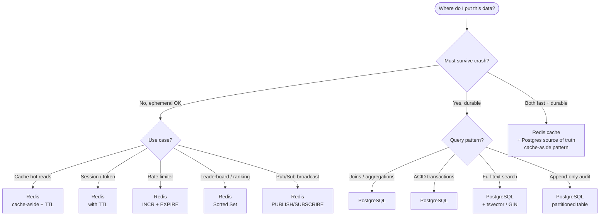

### 🔄 Cache-Aside Read Flow

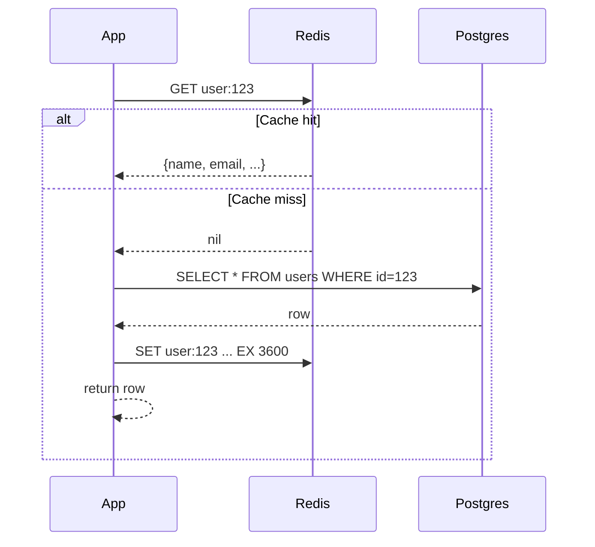

### SQL BASICS

| Query | Description | Example |
|-------|-------------|---------|
| SELECT | Retrieve rows | `SELECT id, name, email FROM users WHERE age > 18 LIMIT 10` |
| INSERT | Add new rows | `INSERT INTO users(name, email) VALUES('Alice', 'alice@example.com')` |
| UPDATE | Modify existing rows | `UPDATE users SET balance = balance + 100 WHERE id = 123` |
| DELETE | Remove rows | `DELETE FROM users WHERE id = 123` |
| WHERE | Filter rows by condition | `SELECT * FROM transactions WHERE amount > 1000 AND status = 'settled'` |
| ORDER BY | Sort results | `SELECT * FROM users ORDER BY created_at DESC LIMIT 10` (newest first) |
| GROUP BY | Aggregate rows | `SELECT user_id, COUNT(*) FROM transactions GROUP BY user_id` (txs per user) |
| HAVING | Filter grouped results | `SELECT user_id, COUNT(*) FROM transactions GROUP BY user_id HAVING COUNT(*) > 100` |
| JOIN | Combine tables | `SELECT u.name, COUNT(t.id) FROM users u LEFT JOIN transactions t ON u.id = t.user_id GROUP BY u.id` |
| LIMIT/OFFSET | Pagination | `SELECT * FROM users LIMIT 20 OFFSET 40` (skip 40, get 20) |
| DISTINCT | Remove duplicates | `SELECT DISTINCT user_id FROM transactions` (unique users) |
| IN | Match multiple values | `SELECT * FROM users WHERE status IN ('active', 'premium', 'trial')` |
| LIKE | Pattern matching | `SELECT * FROM users WHERE email LIKE '%@gmail.com'` |
| BETWEEN | Range query | `SELECT * FROM transactions WHERE created_at BETWEEN '2024-01-01' AND '2024-12-31'` |
| IS NULL | Check null values | `SELECT * FROM users WHERE deleted_at IS NULL` (not deleted) |
| CASE | Conditional logic | `SELECT id, CASE WHEN balance > 1000 THEN 'rich' ELSE 'poor' END FROM users` |

### SQL AGGREGATE FUNCTIONS

| Function | Description | Example |
|----------|-------------|---------|
| COUNT | Count rows | `SELECT COUNT(*) FROM transactions` (total txs) |
| SUM | Sum values | `SELECT SUM(amount) FROM transactions WHERE user_id = 123` (total spent) |
| AVG | Average value | `SELECT AVG(amount) FROM transactions` (avg txn) |
| MIN/MAX | Minimum/maximum | `SELECT MIN(amount), MAX(amount) FROM transactions` (range) |
| STRING_AGG | Concatenate strings | `SELECT STRING_AGG(email, ', ') FROM users` (comma-separated emails) |
| ARRAY_AGG | Array of values | `SELECT user_id, ARRAY_AGG(amount) FROM transactions GROUP BY user_id` |

### SQL JOINS

```
        INNER JOIN              LEFT JOIN              RIGHT JOIN          FULL OUTER JOIN
        ┌─────┬─────┐          ┌─────┬─────┐          ┌─────┬─────┐          ┌─────┬─────┐
        │  ███│███  │          │█████│███  │          │  ███│█████│          │█████│█████│
        │  A  │  B  │          │  A  │  B  │          │  A  │  B  │          │  A  │  B  │
        └─────┴─────┘          └─────┴─────┘          └─────┴─────┘          └─────┴─────┘
       only matching          all A + matching B    matching A + all B      everything from both
```

| Join Type | Description | Example |
|-----------|-------------|---------|
| INNER JOIN | Only matching rows | `SELECT u.name, t.amount FROM users u INNER JOIN transactions t ON u.id = t.user_id` (users with txs) |
| LEFT JOIN | All left rows + matching right | `SELECT u.name, COUNT(t.id) FROM users u LEFT JOIN transactions t ON u.id = t.user_id GROUP BY u.id` (users + txn count, even 0) |
| RIGHT JOIN | All right rows + matching left | Reverse of LEFT JOIN |
| FULL OUTER JOIN | All rows from both tables | `SELECT * FROM users FULL OUTER JOIN transactions ON users.id = transactions.user_id` |
| CROSS JOIN | Cartesian product | `SELECT * FROM users CROSS JOIN categories` (all user-category combinations) |

### SQL WINDOW FUNCTIONS

| Function | Description | Example |
|----------|-------------|---------|
| ROW_NUMBER | Sequential numbering | `SELECT ROW_NUMBER() OVER (ORDER BY created_at) FROM transactions` (each txn gets 1,2,3...) |
| RANK | Ranking with gaps | `SELECT RANK() OVER (ORDER BY score DESC) FROM users` (ties get same rank, skip next) |
| DENSE_RANK | Ranking without gaps | `SELECT DENSE_RANK() OVER (ORDER BY score DESC) FROM users` (ties same rank, no skip) |
| LAG/LEAD | Previous/next row value | `SELECT amount, LAG(amount) OVER (ORDER BY created_at) FROM transactions` (compare to previous) |
| SUM OVER | Running total | `SELECT amount, SUM(amount) OVER (ORDER BY created_at) FROM transactions` (cumulative sum) |
| PARTITION BY | Aggregate per group | `SELECT user_id, amount, SUM(amount) OVER (PARTITION BY user_id) from transactions` (total per user) |

### SQL BEST PRACTICES

| Practice | Description | Example |
|----------|-------------|---------|
| Use Parameterized Queries | Prevent SQL injection | `SELECT * FROM users WHERE id = $1` (NOT concatenating user input) |
| Index on Filter Columns | Speed up WHERE clause | `CREATE INDEX idx_user_status ON users(status)` if frequently filtering by status |
| Avoid SELECT * | Only fetch needed columns | `SELECT id, name FROM users` (not all 50 columns) |
| Use EXISTS instead of IN | Faster for large subsets | `SELECT * FROM users WHERE EXISTS (SELECT 1 FROM transactions WHERE user_id = users.id)` |
| EXPLAIN ANALYZE | Debug slow queries | `EXPLAIN ANALYZE SELECT...` shows execution plan and costs |
| Batch Operations | Reduce round trips | `INSERT INTO users VALUES (...), (...), (...)` (one INSERT, multiple rows) |
| Use Transactions | Ensure consistency | `BEGIN; UPDATE a; UPDATE b; COMMIT;` (all-or-nothing) |
| Archive Old Data | Keep tables manageable | Delete/move transactions > 2 years old to archive table |

### POSTGRESQL FUNDAMENTALS

| Concept | Description | IRL Example |
|---------|-------------|------------|
| ACID Properties | Atomicity, Consistency, Isolation, Durability | Transfer: A debits, B credits, all succeed or all rollback, no in-between state |
| Transactions | Group operations, commit or rollback together | `BEGIN; UPDATE users SET balance=balance-100; UPDATE users SET balance=balance+100; COMMIT;` |
| Constraints | Rules enforced at DB level | `NOT NULL`, `UNIQUE`, `CHECK (age > 0)`, `DEFAULT now()` |
| Primary Key | Unique identifier per row | `id SERIAL PRIMARY KEY` — every user has unique id |
| Foreign Key | Link to another table | `user_id INT REFERENCES users(id)` — transaction must reference existing user |
| Indexes | Speed up searches, trade insert speed for read speed | `CREATE INDEX idx_user_email ON users(email)` — 5s query → 50ms |
| Joins | Combine rows from multiple tables | Find user + all transactions: `SELECT * FROM users JOIN transactions ON users.id = transactions.user_id` |
| Subqueries | Nested queries | Find users with balance > avg: `SELECT * FROM users WHERE balance > (SELECT AVG(balance) FROM users)` |

### POSTGRESQL PERFORMANCE

| Concept | Description | IRL Example |
|---------|-------------|------------|
| EXPLAIN ANALYZE | Show query execution plan | `EXPLAIN ANALYZE SELECT * FROM users WHERE id=123` → reveals if using index |
| Sequential Scan | Linear search through all rows | Bad: 1M rows scanned, slow for large tables |
| Index Scan | Use index to find rows | Good: index jump straight to row, O(log n) |
| Bitmap Index Scan | Combine multiple indexes | Medium: two columns indexed, combine results |
| Query Optimization | Rewrite slow queries | Add WHERE early, use JOINs not subqueries, limit results |
| Statistics | Optimizer uses table stats | `ANALYZE table_name` — update stats so planner makes good choices |
| Slow Query Log | Log queries > threshold | `log_min_duration_statement = 1000` — log queries taking > 1s |
| Connection Pooling | Reuse connections, avoid creation overhead | PgBouncer: 10K app connections → 100 DB connections (reused) |

### POSTGRESQL ADVANCED

| Concept | Description | IRL Example |
|---------|-------------|------------|
| Sharding | Split data across multiple servers | User 0-999 on DB1, 1000-1999 on DB2 (partition by hash) |
| Replication | Copy data to replica for reads/backup | Master: writes, Replica: reads (async), failover if master dies |
| JSONB | Store flexible data in column | `metadata JSONB` → store `{"tier": "gold", "verified": true}` |
| Full-Text Search | Index for text search | `CREATE INDEX idx_search ON posts USING GIN(to_tsvector('english', content))` |
| Window Functions | Aggregate across row groups | `ROW_NUMBER() OVER (PARTITION BY user_id ORDER BY created_at)` — rank transactions per user |
| Common Table Expression (CTE) | Reusable subquery, cleaner code | `WITH recent AS (SELECT * FROM txs WHERE created > NOW()-1d) SELECT * FROM recent WHERE amount > 1000` |
| Triggers | Auto-execute on events | `AFTER INSERT ON transactions → update user balance, send notification` |
| Extensions | Add features (PostGIS, UUID, etc.) | `CREATE EXTENSION uuid-ossp` — use UUID data type |

### REDIS FUNDAMENTALS

| Concept | Description | IRL Example |
|---------|-------------|------------|
| Key-Value Store | Ultra-fast in-memory cache | User profile: `users:{user_id} → {name, email, balance}` (set/get in 1ms) |
| Data Types | String, List, Set, Sorted Set, Hash | Leaderboard: sorted set `scores` with member=user, score=points |
| TTL (Time To Live) | Auto-expire key after N seconds | Cache user: `SET user:123 ... EX 3600` (expire in 1 hour) |
| Persistence | RDB snapshots or AOF logs | RDB: snapshot every 60s, AOF: log every write (slower, safer) |
| Pub/Sub | Publish-Subscribe messaging | Publish: `PUBLISH channel:transactions tx-data`, Subscribe: listen for updates real-time |
| Transactions | Multi/Exec atomicity | `MULTI; SET a 1; SET b 2; EXEC` — both commands execute or both fail |
| Lua Scripting | Run scripts atomically on server | `EVAL script 1 key arg` — atomic operation, no race conditions |
| Connection Pooling | Reuse connections | ioredis client pool: 10 connections, queue if busy |

### REDIS PATTERNS & USE CASES

| Pattern | Description | IRL Example |
|---------|-------------|------------|
| Session Store | Store user sessions | `sessions:{session_id} → {user_id, login_time}` with 24h TTL |
| Cache Layer | Cache expensive DB queries | `user:123:profile → {...}`, if miss query DB, set cache |
| Rate Limiting | Track requests per user | `rate:user:123 → count`, increment, check < limit, INCR and EXPIRE |
| Leaderboard | Sorted set for rankings | `leaderboard → {user1: 1000pts, user2: 950pts}`, `ZRANGE leaderboard 0 9` = top 10 |
| Job Queue | Store jobs with priority | `job:queue → [{id, priority, data}]`, workers pop and process |
| Real-time Analytics | Counters, HyperLogLog | `views:today → count`, `HLL users:today → unique users` |
| Session Lock | Distributed lock | `lock:transfer:user123 → timestamp`, fail if exists, release after 5s |
| Caching Patterns | Cache-aside, write-through, write-behind | Cache-aside: check cache, miss → query DB, populate cache |

### REDIS VS POSTGRESQL

| Scenario | Best Choice | Why |
|----------|-------------|-----|
| User profile (frequently accessed) | Redis | O(1) lookup, 1ms vs 50ms on DB |
| Persistent critical data (transactions) | PostgreSQL | Durability guaranteed, ACID |
| Real-time leaderboard | Redis | Sorted set built-in, instant updates |
| Complex queries (joins, aggregations) | PostgreSQL | SQL flexibility, indexing |
| Session storage | Redis | Fast, auto-expire, perfect for sessions |
| Audit log (immutable history) | PostgreSQL | Append-only, ACID, compliance |
| Rate limiting | Redis | Fast counters, TTL auto-cleanup |
| Analytics (billions of events) | PostgreSQL | Batch processing, disk-backed |

### CACHING STRATEGIES

| Strategy | Description | IRL Example |
|---------|-------------|------------|
| Cache-Aside | Check cache, miss → DB, populate | App checks Redis, miss → query Postgres, `SET cache 3600s` |
| Write-Through | Write to cache + DB together | Write to Redis, then Postgres (slower but consistent) |
| Write-Behind | Write to cache first, async to DB | Write to Redis (fast), queue async write to Postgres (eventual consistency) |
| Cache Invalidation | Expire stale data | TTL: auto-expire every 60s, or manual: user updates profile → delete cache |
| Cache Warming | Pre-load cache | Startup: load top 1000 users into Redis before traffic arrives |
| Cache Stampede | Too many misses at once | When cache expires: 1000 requests hit DB simultaneously. Use lock to serialize |
| Cache Coherence | Keep cache consistent | Update user profile → delete cache, next query hits DB, repopulates cache |

---

## 8. REACT/NEXTJS BASICS

### ⚛️ React Component Lifecycle (Hooks Era)

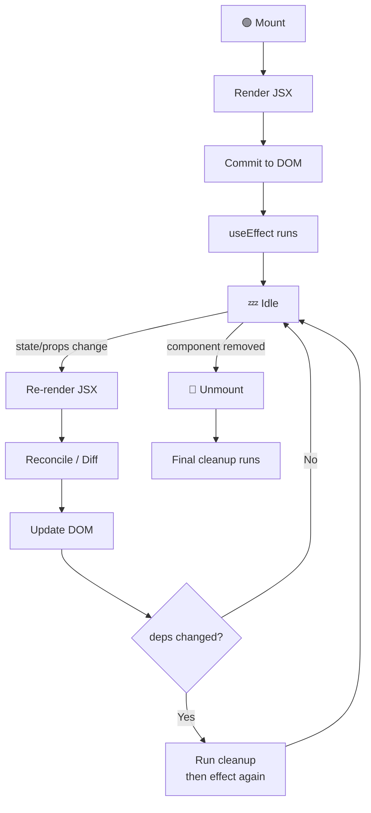

### 🔀 Next.js Data Fetching: Pick the Right Method

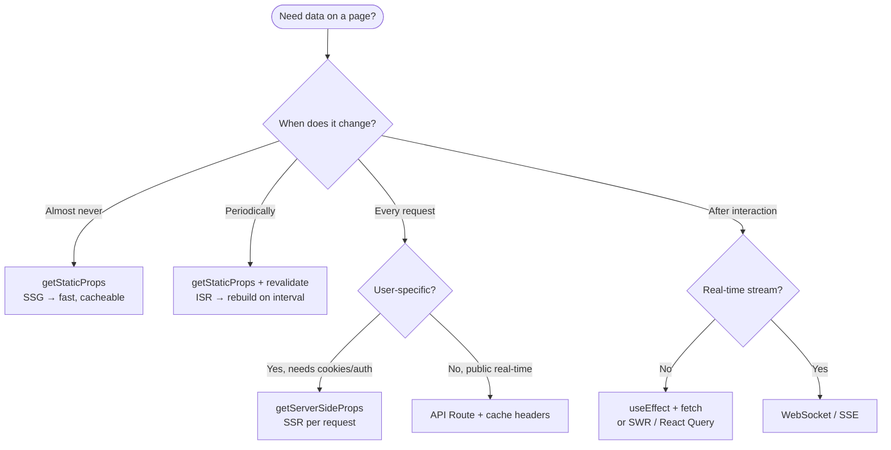

### REACT FUNDAMENTALS

| Concept | Description | Example |
|---------|-------------|---------|
| Components | Reusable UI building blocks | `function UserCard({user}) { return <div>{user.name}</div> }` |
| JSX | HTML-like syntax in JavaScript | `<button onClick={handleClick}>Click me</button>` |
| Props | Pass data to components | `<UserCard user={userData} />` — component receives as props |
| State (useState) | Component's local data, triggers re-render on change | `const [count, setCount] = useState(0)` |
| Effects (useEffect) | Side effects: API calls, subscriptions, cleanup | `useEffect(() => { fetchUser(); }, [userId])` (runs when userId changes) |
| Conditional Rendering | Show/hide based on state | `{isLoggedIn ? <Dashboard /> : <Login />}` |
| Lists & Keys | Render arrays efficiently | `{users.map(u => <UserCard key={u.id} user={u} />)}` |
| Event Handling | Respond to user interactions | `<button onClick={() => handleSubmit()}>Submit</button>` |
| Form Handling | Capture input | `<input value={email} onChange={e => setEmail(e.target.value)} />` |
| Controlled vs Uncontrolled | React controls input or DOM does | Controlled: state manages value, Uncontrolled: DOM manages (use ref) |

### REACT HOOKS

| Hook | Description | Example |
|------|-------------|---------|
| useState | Manage local state | `const [name, setName] = useState('')` |
| useEffect | Side effects (fetch, subscribe, cleanup) | `useEffect(() => fetchData(), [dependency])` |
| useContext | Access context without prop drilling | `const user = useContext(UserContext)` |
| useReducer | Complex state logic | `const [state, dispatch] = useReducer(reducer, initialState)` |
| useRef | Access DOM element or persist value | `const inputRef = useRef(); inputRef.current.focus()` |
| useMemo | Memoize expensive calculations | `const expensiveValue = useMemo(() => compute(), [deps])` |
| useCallback | Memoize function, prevent re-creation | `const handleClick = useCallback(() => {...}, [deps])` |
| useCustomHook | Reuse logic across components | `const user = useUser(userId)` (custom hook) |

### STATE MANAGEMENT

| Pattern | Description | Example |
|---------|-------------|---------|
| Local State | useState in component | Simple: form input, toggle, counter |
| Context API | Share state across components without prop drilling | Auth context: wrap app, all children access `useContext(AuthContext)` |
| Redux | Centralized state, actions, reducers | Store: { users, transactions }, dispatch(addUser(userData)) |
| Zustand | Lightweight state, similar to Redux but simpler | `const useStore = create(set => ({users: [], addUser}))` |
| useReducer | Complex local state logic | Multiple related states: useState × 5 → useReducer × 1 |
| Prop Drilling | Pass props through many levels | Parent → Child → GrandChild → GreatGrandChild (avoid with Context) |

### PERFORMANCE & OPTIMIZATION

| Technique | Description | Example |
|-----------|-------------|---------|
| Code Splitting | Load JS only when needed | Dynamic import: `const Modal = dynamic(() => import('./Modal'))` (lazy load) |
| Lazy Loading | Defer loading of offscreen components | `<Image loading="lazy" />` or intersection observer |
| Memoization | Cache component render | `export default React.memo(UserCard)` (skip re-render if props unchanged) |
| Key in Lists | Help React identify which items changed | `{items.map(item => <Item key={item.id} />)}` |
| Image Optimization | Use next/image for responsive, optimized images | Auto WebP conversion, responsive srcset |
| Bundle Analysis | Check bundle size | `npm run analyze` — see what's making bundle large |
| Minification | Remove unused code | Next.js auto-minifies, reduce size 30-50% |
| Caching Headers | Browser/CDN caching | `Cache-Control: public, max-age=3600` — cache for 1 hour |

### COMMON PATTERNS

| Pattern | Description | Example |
|---------|-------------|---------|
| Container/Presentational | Smart (data) + Dumb (UI) components | Container fetches data, Presentational just renders |
| Render Props | Pass render function as prop | `<DataFetcher render={data => <div>{data}</div>} />` |
| Higher-Order Component (HOC) | Wrap component, add functionality | `withAuth(Dashboard)` — adds auth check |
| Custom Hooks | Extract component logic | `useUser(id)` — encapsulates fetch + loading + error |
| Error Boundary | Catch errors in component tree | Catch render errors, show fallback UI (class component) |
| Portal | Render outside DOM hierarchy | Modals, tooltips rendered in body, not inside nested div |
| Compound Components | Components work together | `<Select><Option>A</Option><Option>B</Option></Select>` |

### FORM HANDLING

| Library/Approach | Description | Example |
|------------------|-------------|---------|
| Controlled Inputs | React state manages input | `<input value={email} onChange={e => setEmail(e.target.value)} />` |
| React Hook Form | Lightweight form validation | `const {register, handleSubmit} = useForm(); <input {...register('email')} />` |
| Formik | Form state + validation + errors | `<Formik><Form><Field name="email" /></Form></Formik>` |
| Validation | Client-side checks before submit | Email format, min length, required fields |
| Error Handling | Show validation messages | `{errors.email && <span>{errors.email}</span>}` |
| Submit Handler | Send to server | `onSubmit = async (data) => { const res = await fetch('/api/users', {method: 'POST', body: JSON.stringify(data)}) }` |

### COMMON MISTAKES TO AVOID

| Mistake | Problem | Solution |
|--------|---------|----------|
| Missing key in lists | React can't track items, animations break | Always use unique `key={item.id}` |
| setState in render | Infinite loop, bad performance | Use useEffect for side effects |
| useEffect without deps | Runs every render, too many API calls | Always add dependency array |
| Mutating state directly | React doesn't detect change, UI doesn't update | Use setState or spread operator |
| Over-memoization | Wasted effort memoizing tiny components | Only memoize if you measure performance gain |
| Prop drilling too deep | Unmaintainable, hard to refactor | Use Context or state management library |
| Client-side rendering secrets | API keys exposed in browser | Keep secrets on server (getServerSideProps, API routes) |

### NEXTJS FEATURES

| Feature | Description | Example |
|---------|-------------|---------|
| File-based Routing | Pages from file structure | `/pages/users/[id].js` → route: `/users/123` |
| API Routes | Server-side endpoints without separate backend | `/pages/api/users.js` → `GET /api/users` |
| SSR (Server-Side Rendering) | Render on server, send HTML to client | `getServerSideProps` — fetch data server-side, SSR each request |
| SSG (Static Site Generation) | Pre-build pages at build time | `getStaticProps` — fetch once at build, serve static HTML (fast) |
| ISR (Incremental Static Regeneration) | Revalidate static pages on demand | `revalidate: 3600` — rebuild page every 1 hour |
| Dynamic Routes | Route parameters | `/pages/posts/[id].js` → `/posts/123`, `/posts/456` |
| Middleware | Intercept requests/responses | Verify auth, redirect, add headers before handler |
| Image Optimization | Auto-optimize images | `<Image src="pic.jpg" width={300} height={200} />` (lazy load, responsive) |
| Automatic Code Splitting | Split JavaScript per page | Only load JS needed for current page, reduce bundle |
| Environment Variables | .env.local for secrets | `process.env.API_KEY` → use in server-side code |

### NEXTJS DATA FETCHING

| Method | When to Use | Example |
|--------|------------|---------|
| getServerSideProps | Dynamic, user-specific data, real-time | `export async function getServerSideProps(ctx) { const user = await fetchUser(ctx.params.id); return {props: {user}} }` |
| getStaticProps | Static content, slow data fetches, don't change often | Blog posts, SEO landing pages (build once, serve always) |
| getStaticPaths | Define dynamic routes at build time | `/blog/[slug].js` — getStaticPaths returns all slugs |
| API Routes | Server logic, database calls, secrets | `/api/users.js` — `export default async (req, res) => { const users = await db.query(...); res.json(users) }` |
| Client-side fetch | Interactive data, user actions | `useEffect(() => { fetch('/api/users').then(r => r.json()).then(setUsers) }, [])` |

---

## 9. AI BASICS

### 🔄 Retrieval-Augmented Generation (RAG) Pipeline

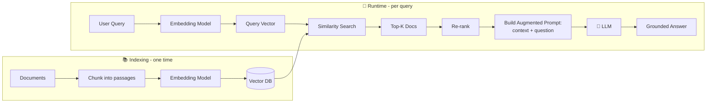

### 🤖 Agent ReAct Loop (Reasoning + Acting)

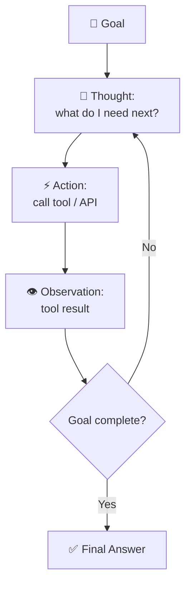

### AI FUNDAMENTALS

| Concept | Description | Example |
|---------|-------------|---------|
| LLM (Large Language Model) | Neural network trained on text, predicts next token | GPT-4, Claude, LLaMA: given prompt → generate response |
| Tokens | Text broken into pieces (words/subwords) | "Hello world" → ["Hello", "world"], or ["Hel", "lo", "wor", "ld"] depending on tokenizer |
| Prompt Engineering | Craft input to get better output | Bad: "summarize", Good: "Summarize in 3 bullet points, focus on costs" |
| Temperature | Randomness in generation, 0-1 scale | 0 = deterministic (always same), 1 = random (creative), 0.7 = balanced |
| Top-K/Top-P Sampling | Limit token choices for quality | Top-K=10: choose from top 10 likely next tokens, ignore tail |
| Context Window | Max tokens in prompt + response | GPT-4: 128K tokens (~100K words), larger = remember more history |
| Fine-tuning | Adapt model to specific domain | Train on fintech data: LLM learns payment/transaction language |
| Embeddings | Convert text to vector (dense numbers) | "payment" → [0.23, -0.45, 0.12, ...] (capture semantic meaning) |

### RETRIEVAL AUGMENTED GENERATION (RAG)

| Component | Description | Example |
|-----------|-------------|---------|
| Vector DB | Store text embeddings, search by similarity | Pinecone, Weaviate, Qdrant: query "payment failed" → find similar docs |
| Embedding Model | Convert text to vectors | OpenAI embedding model: "transfer money" → 1536-dim vector |
| Document Chunking | Split long docs into chunks for indexing | 10K word document → 500 word chunks (16 chunks), each embedded |
| Retrieval | Find relevant docs for query | User asks "how to refund?" → retrieve 3 most similar docs from vector DB |
| Augmentation | Add retrieved docs to LLM prompt | Prompt = "Context: [doc1, doc2, doc3]\n\nQuestion: how to refund?" |
| Generation | LLM answers using context | LLM generates answer informed by retrieved docs, not just training data |
| Re-ranking | Re-order retrieved docs by relevance | Retrieved 10 docs, re-rank by semantic similarity to query, use top 3 |

### VECTOR DATABASES

| Database | Characteristics | Use Case |
|----------|-----------------|----------|
| Pinecone | Managed vector DB, easy scale, live data updates | SaaS: customer docs search, semantic search on live data |
| Weaviate | Open-source, on-prem or cloud, GraphQL API | Enterprise: store proprietary docs, fine-grained control |
| Qdrant | Fast, Rust-based, good performance, open-source | High-throughput similarity search, real-time |
| Milvus | Open-source, cloud-native, scalable | Data centers: handle billions of vectors |
| Elasticsearch (vector) | Traditional search + vectors, hybrid | Full-text + semantic search together |
| PostgreSQL pgvector | Vector extension for Postgres | Keep vectors in same DB as data (simpler architecture) |

### VECTOR SIMILARITY & SEARCH

| Concept | Description | Example |
|---------|-------------|---------|
| Cosine Similarity | Measure angle between vectors, -1 to 1 scale | Vec1 = [0.1, 0.9], Vec2 = [0.2, 0.8], similarity = 0.98 (very similar) |
| Euclidean Distance | Straight-line distance in vector space | Smaller distance = more similar, find k nearest neighbors |
| Approximate Nearest Neighbor (ANN) | Fast search without checking all vectors | HNSW, IVF: index structures, query in milliseconds (not linear scan) |
| Semantic Search | Find docs by meaning, not keywords | Query "investment strategy" matches "portfolio allocation" (synonyms) |
| Hybrid Search | Combine keyword + semantic search | Search both full-text index + vector DB, merge results |
| Dimensionality Reduction | Reduce vector size (512 → 128) | Use UMAP/t-SNE to compress, faster search, less storage |

### VECTOR DB VS TRADITIONAL DB

| Dimension | Vector DB | Traditional DB (Postgres) |
|-----------|-----------|------------------------|
| Search | Semantic similarity, fast ANN | Exact match, full-text search |
| Data Type | Vectors (embeddings) | Structured (tables, rows) |
| Indexing | HNSW, IVF, flat index | B-tree, hash index |
| Query Complexity | O(log n) with ANN | O(n) or O(log n) with index |
| Use Case | Semantic search, recommendations | Transactional data, ACID |
| Scale | Billions of vectors | Terabytes of structured data |
| Cost | Specialized infra | General-purpose |
| Combo | Use both: Postgres for data, vector DB for semantic search | Hybrid approach best |

### AI AGENTS

| Concept | Description | Example |
|---------|-------------|---------|
| Agent | AI system that reasons and takes actions | User: "transfer $100 to Alice", Agent: reason → call bank API → confirm |
| Tool/Function Calling | LLM calls external functions | Agent: "I need to check balance" → call `get_balance()` → receives result |
| Reasoning Loop | Agent thinks → acts → observes → repeats | Plan transfer → execute → check result → retry if failed |
| ReAct (Reasoning + Acting) | LLM alternates thinking and acting | Thought: "need user ID", Act: lookup user, Observe: found ID=123 |
| Autonomous Agent | Operates without human in loop | Background: process refunds, no user prompts, runs until done |
| Multi-Agent System | Multiple agents coordinate | Compliance agent checks rules, Payment agent executes, Notification agent alerts |
| Agent Memory | Track state and history | Remember previous transactions, learned preferences, context from past actions |

### PROMPT ENGINEERING TECHNIQUES

| Technique | Description | Example |
|-----------|-------------|---------|
| Few-Shot Prompting | Show examples, then ask question | "Classify as HIGH/MEDIUM/LOW: \n Example1... \n Example2... \n Now classify: ..." |
| Chain-of-Thought | Ask LLM to reason step-by-step | "Explain your reasoning:\n 1. ...\n 2. ...\n Answer: ..." |
| System Prompt | Set LLM's behavior/role | "You are a financial advisor. Be concise, accurate, cite sources." |
| Prompt Chaining | Break task into multiple prompts | Step1: analyze issue, Step2: propose solutions, Step3: evaluate |
| Temperature Tuning | Control creativity | Summarization: temp=0.2 (consistent), Brainstorm: temp=0.9 (creative) |
| Token Limits | Constrain response length | "Answer in max 100 tokens" prevents verbose outputs |
| Negative Prompting | Tell what NOT to do | "Don't mention pricing, don't use technical jargon, be casual" |

### MODEL CONTEXT PROTOCOL (MCP)

| Component | Description | Example |
|-----------|-------------|---------|
| MCP | Standard for AI to interact with external tools | Claude + MCP → connects to your APIs, DBs, file systems |
| MCP Server | Hosts tools/resources for AI to use | Finance MCP Server: exposes tools like get_balance(), transfer_funds() |
| MCP Client | Claude or app using MCP servers | Claude client: connects to multiple MCP servers, uses their tools |
| Tools | Functions AI can call | Tool: transfer(from, to, amount) → AI decides when/how to call |
| Resources | Data sources AI can access | Resource: user portfolio, historical transactions, market data |
| Prompts | Pre-built prompt templates | Template: "Analyze spending patterns for user {user_id}" |
| Request-Response | AI requests tool output, server responds | AI: "get_balance(user_id=123)", Server: returns {balance: 5000} |
| Constraints | Limits on tool usage | Rate limit: 100 transfers/hour, max amount: $10K per transfer |

### MCP USE CASES

| Use Case | Description | Example |
|----------|-------------|---------|
| Knowledge Integration | AI accesses live company data | MCP connects Claude to Slack, Jira, Google Docs → answer "what's in sprint?" |
| API Integration | AI calls your backend APIs | MCP tool: call_api(endpoint, method, params) → AI uses to transfer funds, check balance |
| Database Access | AI queries databases safely | MCP server: executes queries, returns results, AI analyzes |
| File System | AI reads/writes files | MCP tool: read_file(path), write_file(path, content) → process documents |
| Code Execution | AI runs code to solve problems | MCP tool: execute_python(code) → AI writes/executes analysis |
| Real-time Data | AI accesses live market data | MCP resource: stock_prices → Claude recommends based on current prices |

### COMMON AI PATTERNS

| Pattern | Description | Example |
|---------|-------------|---------|
| RAG | Retrieve docs, augment prompt, generate answer | Customer support: retrieve docs → generate answer grounded in company info |
| Fine-tuning | Adapt model to domain | Train on finance data → model understands "settlement", "custody", "NAV" |
| Semantic Caching | Cache embeddings, reuse for similar queries | Query1: "refund policy", Query2: "refund process" → use cached embedding |
| Agentic Loop | Agent reasons → acts → observes → repeats | Booking agent: check availability → reserve → confirm → notify |
| Confidence Scoring | LLM rates confidence in answer | Answer: "transfer approved", Confidence: 0.95 (high) → proceed, else escalate |
| Fallback Strategy | If AI uncertain, escalate to human | AI: "not confident" (score < 0.5) → escalate to support agent |
| Token Counting | Track token usage, prevent overspend | Before API call: count tokens, estimate cost, reject if > budget |

### AI SECURITY & ETHICS

| Concern | Description | Mitigation |
|---------|-------------|-----------|
| Prompt Injection | User input tricks AI into wrong behavior | Validate inputs, use system prompts, separate user input from logic |
| Hallucinations | AI makes up facts confidently | Use RAG to ground in real data, ask for sources, add confidence scores |
| Data Leakage | Sensitive data in prompts exposed via API | Don't send PII to third-party APIs, use on-prem models if critical |
| Model Bias | AI trained on biased data, perpetuates bias | Audit model outputs, use diverse training data, add fairness checks |
| Token Limit Abuse | User sends huge prompts, expensive | Set max tokens, rate limit, charge per token |
| Jailbreaking | User tricks AI to violate guardrails | Add system prompts, monitor outputs, fine-tune on safe data |
| Compliance | Financial AI must follow regulations | Document decisions, keep audit trail, explain model behavior |

---

## 10. SYSTEM DESIGN

### 🏛️ Layered Web-Scale Architecture

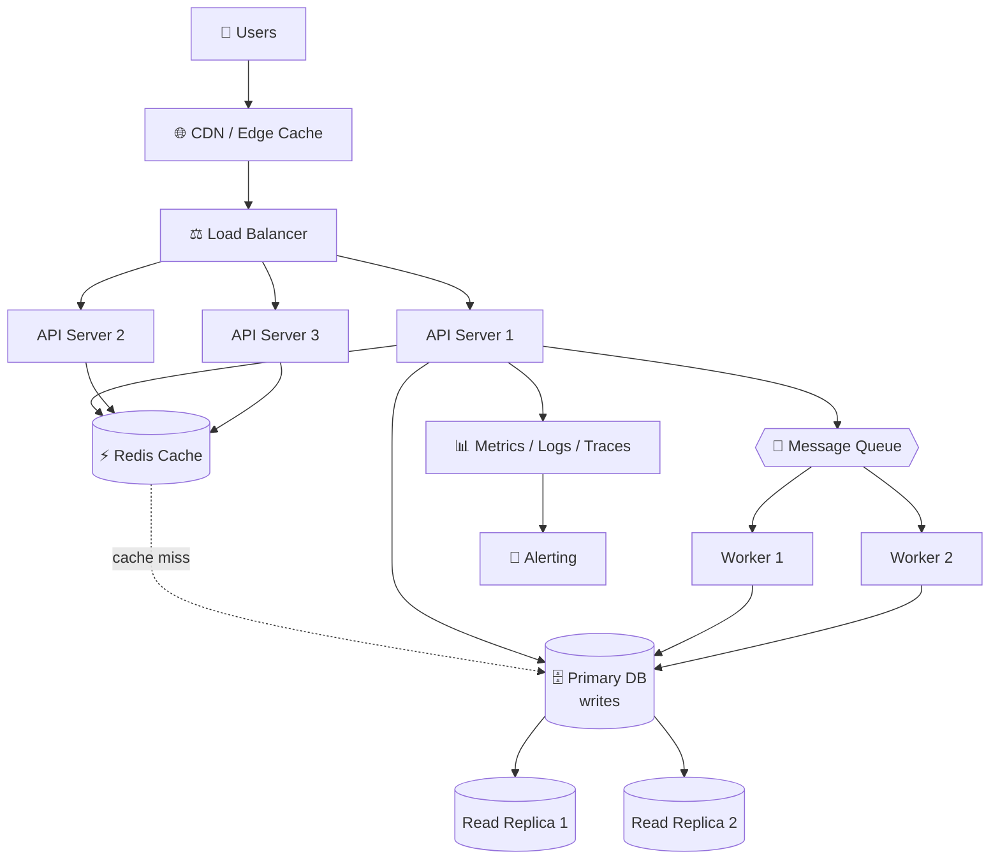

### 🔀 "How Do I Scale This?" Decision Tree

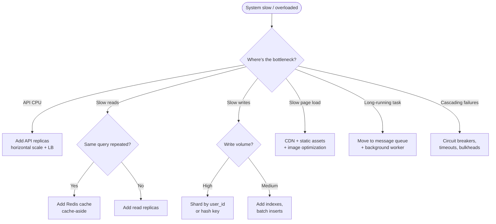

### 📊 Latency Budget Reference

```
Operation                       Typical Latency       Budget Impact
────────────────────────────────────────────────────────────────────
L1 cache reference              0.5 ns                ▏ negligible
Branch mispredict               5 ns                  ▏ negligible
Mutex lock/unlock               25 ns                 ▏ negligible
Memory access                   100 ns                ▏ negligible
Compress 1KB (Zippy)            3 µs                  ▏ negligible
Send 1KB over 1 Gbps network    10 µs                 ▏ tiny
Read 4KB from SSD               150 µs                ▎ small
Read 1MB sequentially from RAM  250 µs                ▎ small
Round trip in same datacenter   500 µs                ▎ small
Read 1MB sequentially from SSD  1 ms                  █ noticeable
Disk seek (HDD)                 10 ms                 ███ slow
Read 1MB from HDD               20 ms                 ███████ slow
Send packet CA → Netherlands    150 ms                ████████████████ painful
```

### DESIGN PRINCIPLES

| Principle | Description | Example |
|-----------|-------------|---------|
| Scalability | System handles growing load (users, data, traffic) | 1K users → 1M users: add more servers, replicate DB, shard data |
| Availability | System stays up, minimal downtime (99.9% uptime) | Multiple replicas, failover, health checks, graceful degradation |
| Consistency | All replicas have same data at same time | Strong: all writes synced before ack, Eventual: sync after ack |
| Latency | Response time from request to response | p50 < 100ms, p99 < 1s (measure at percentiles, not avg) |
| Reliability | System works correctly under faults | Backups, retries, circuit breakers, no data loss |
| Throughput | Requests processed per second (RPS) | Target: 10K RPS, measure via load testing |
| Durability | Data persists after writes (ACID in DB) | Write to disk/replicas before ack, no data loss on crash |

### LOAD BALANCING & SCALING

| Concept | Description | Example |
|---------|-------------|---------|
| Horizontal Scaling | Add more servers | From 1 API server to 10 servers behind load balancer |
| Vertical Scaling | Bigger server (more CPU/RAM) | Upgrade from 4GB to 32GB RAM (limited, gets expensive) |
| Load Balancer | Distribute requests across servers | Round-robin, least-loaded, consistent hashing |
| Round-Robin | Cycle through servers | Req1 → S1, Req2 → S2, Req3 → S3, Req4 → S1... |
| Least-Loaded | Send to server with fewest connections | Req1 → S2 (5 conns), Req2 → S3 (3 conns) |
| Consistent Hashing | Map requests based on key, minimize redistribution | User123 always goes to same server (session affinity) |
| CDN (Content Delivery Network) | Cache static content geographically | User in Japan hits Japan CDN, not US origin server (faster) |
| Auto-scaling | Automatically add/remove servers based on load | CPU > 80% → add 2 servers, CPU < 20% → remove 1 server |

### CACHING STRATEGIES (MULTI-LAYER)

| Layer | Technology | When to Invalidate |
|-------|-----------|-------------------|
| Client Cache | Browser, localStorage | User logs out, session expires |
| CDN Cache | CloudFlare, Akamai | Content changes (manual purge) |
| API Response Cache | Redis, Memcached | TTL (60s), or event-based invalidation |
| Database Query Cache | Redis (SELECT result) | Data updated, use versioning key |
| Database Buffer Pool | In-memory, inside Postgres | Automatic (LRU eviction) |

### DATABASE SCALING

| Technique | Trade-off | Example |
|-----------|-----------|---------|
| Read Replicas | Replication lag (eventual consistency) | Master: writes, 2 replicas: reads (async) |
| Sharding | Complex queries (can't join across shards) | User 0-999 → Shard1, 1000-1999 → Shard2 |
| Vertical Partitioning | More tables, complex schema | Separate: hot data (user profile) vs cold data (audit logs) |
| Connection Pooling | Limited by pool size | 10K app connections → 100 DB connections (reused) |
| Query Optimization | Development cost | Index, denormalization, caching |
| Archive Old Data | Restore from archive is slow | Move txns > 2 years to separate table/DB |

### API DESIGN

| Aspect | Best Practice | Example |
|--------|---------------|---------|
| REST Conventions | GET (read), POST (create), PUT (update), DELETE (delete) | `POST /transfers`, `GET /transfers/:id`, `DELETE /transfers/:id` |
| Status Codes | 200 (ok), 201 (created), 400 (bad request), 401 (auth), 429 (rate limit), 500 (error) | Retry on 5xx, fail on 4xx |
| Pagination | Limit + offset or cursor-based | `GET /users?limit=20&offset=40` or `?cursor=abc123` |
| Rate Limiting | Limit per user/IP/API key | 100 requests/min per user, return 429 if exceeded |
| Versioning | URL path or header | `/v1/users`, `/v2/users` (backward compatibility) |
| Idempotency | Same request = same result, safe to retry | `Idempotency-Key: tx-123` header prevents double-charge |
| Error Handling | Consistent error format | `{error: "insufficient funds", code: "INSUFFICIENT_BALANCE"}` |
| Documentation | Keep updated, use OpenAPI/Swagger | Auto-generate from code, test endpoints |

### MESSAGE QUEUES & ASYNC PROCESSING

| Queue | Characteristics | Use Case |
|-------|-----------------|----------|
| RabbitMQ | Reliable, traditional message broker, acknowledgments | Guaranteed delivery, ACID |
| Kafka | High-throughput, immutable log, event streaming | Event sourcing, millions of events/sec |
| AWS SQS | Managed, simple, eventual consistency | Decoupling, background jobs |
| Bull/BullMQ | Node.js job queue, Redis-backed | Background tasks, retries, delays |

**When to use async:**
- Slow operation (email, PDF generation) → queue, respond 202 Accepted
- Non-critical side effect (analytics, notification) → decouple from main flow
- Batch processing (ETL, export) → process in background

### MONITORING & ALERTING

| Metric | Target | How to Track |
|--------|--------|--------------|
| Request Latency | p50 < 100ms, p99 < 1s | Application metrics, DataDog/New Relic |
| Error Rate | < 1% (0.5% for critical) | Application logs, count 5xx responses |
| CPU/Memory | < 70% (headroom for spikes) | Infrastructure metrics, Prometheus |
| Disk Space | < 80% full | Storage metrics, alert at 85% |
| Database Connections | < 80% of pool | Active connections counter |
| Queue Depth | < 1000 messages | Queue size, process faster if backlog |
| Crash Rate | < 0.5% for mobile, < 0.1% for backend | Sentry/Firebase Crashlytics |

**Alerting:**
- Page on-call for: error_rate > 5%, latency_p99 > 5s, CPU > 90%
- Slack alert for: error_rate > 1%, latency rising, queue backlog

### TRADE-OFFS & CAP THEOREM

```
                       CAP Theorem
                      Pick any TWO

                       Consistency
                          ╱  ╲
                         ╱    ╲
              CP        ╱      ╲       CA
        (banking,      ╱        ╲   (single-node
       trading apps)  ╱          ╲      RDBMS)
                     ╱            ╲
                    ╱              ╲
                   ╱     ── AP ──   ╲
                  ╱   (social feeds, ╲
                 ╱     DNS, gaming)   ╲
        Partition ────────────────── Availability
        Tolerance
```

| Tradeoff | Choose This If |
|----------|----------------|
| **Consistency vs Availability** (CAP) | Financial txns: consistency (strong), Gaming: availability (eventual consistency) |
| **Read Replicas vs Sharding** | Mostly reads: replicas, mostly writes: sharding |
| **Caching vs Freshness** | High traffic: cache with TTL, must be fresh: query DB |
| **Horizontal vs Vertical Scale** | Unlimited scale needed: horizontal, simple system: vertical |
| **Sync vs Async Processing** | User waits: sync, user doesn't care: async |
| **Relational vs NoSQL** | Complex queries + ACID: relational, flexible schema + scale: NoSQL |
| **Monolith vs Microservices** | <50 engineers: monolith, >100 engineers: microservices |

### REAL-WORLD EXAMPLES

**Design a Payment System**
```
Components:
  API Gateway → User Service → Payment Service → Settlement Service → Notification Service
  Redis (cache user balance, rate limit)
  Postgres (txns, audit log)
  Message Queue (async settlement, notification)

Scalability:
  Load balancer across 3 API servers
  Read replicas for Postgres (reads)
  Shard by user_id for write scalability

Latency:
  Cache user in Redis (1ms vs 50ms DB)
  Return 202 Accepted immediately, settle async

Reliability:
  Idempotency key (prevent double-charge)
  Retry failed settlements
  Dead letter queue for failures
```

**Design a Leaderboard (real-time rankings)**
```
Components:
  Redis Sorted Set (user_id → score)
  Postgres (persist scores, audit)
  Message Queue (score updates)

Scalability:
  Redis handles millions of scores O(log n)
  Shard by game_id if needed

Latency:
  Read from Redis (1ms), cache results
  Update Redis async

Consistency:
  Eventual consistency OK (eventual updates fine)
  Sync Redis → Postgres hourly
```

**Design a Notification System**
```
Components:
  Message Queue (RabbitMQ/Kafka)
  User Service (who to notify)
  Notification Service (email, SMS, push)
  Template Engine (render message)
  Rate Limiter (don't spam)

Scalability:
  Queue decouples producers + consumers
  Scale notification workers independently

Reliability:
  Message persists in queue
  Retry with exponential backoff
  Dead letter queue for stuck messages
```

### COMMON INTERVIEW QUESTIONS

| Question | How to Answer |
|----------|---------------|
| "Design X system" | Draw architecture → identify bottlenecks → propose solutions (caching, sharding, etc.) → discuss trade-offs |
| "How to scale to 1M users?" | Identify bottleneck (DB? API? cache?), propose scaling strategy (replicas, sharding, CDN) |
| "What if X fails?" | Propose fallback (replicas, retry, circuit breaker, graceful degradation) |
| "How to reduce latency?" | Cache (Redis), async (queue), compress (gzip), CDN, database optimization |
| "How to ensure reliability?" | Backups, replication, health checks, alerts, circuit breakers, retry logic |

### SYSTEM DESIGN CHECKLIST

**Always cover these:**
- ✅ **Functional Requirements**: What does the system do? (payments, leaderboard, etc.)
- ✅ **Non-Functional Requirements**: Scale (1M users?), latency (< 100ms?), availability (99.9%?)
- ✅ **Architecture**: Components, data flow, APIs
- ✅ **Scaling**: Horizontal, replicas, sharding, caching
- ✅ **Storage**: Relational vs NoSQL, replication strategy
- ✅ **Trade-offs**: Consistency vs availability, latency vs freshness
- ✅ **Reliability**: Failover, retry, circuit breaker, idempotency
- ✅ **Monitoring**: Metrics, alerts, dashboards
- ✅ **Cost**: Infrastructure, licensing, operational overhead